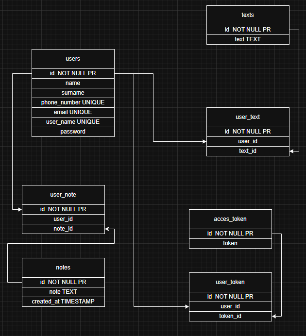

# Web_Project — учебное веб-приложение

---

## 📌 Назначение проекта
**Web_Project** — это учебный pet-проект, созданный с целью отработки ключевых навыков веб-разработки с использованием Java и Spring Boot.  
Он симулирует процесс разработки реального приложения "с нуля", включая работу с базой данных и архитектурными паттернами.

---

## 🛠️ Используемые технологии

- Java 17
- Spring Boot
- PostgreSQL
- HTML / CSS
- Thymeleaf
- Maven

---

## ⚙️ Что умеет приложение ##
1. Регистрация:
  - Введите свои данные (email, номер телефона, имя и фамилию, имя пользователя и пароль) и вы можете спокойно пользоваться приложением!
2. Входить как существующий пользователь:
  - Введите имя пользователя и пароль и продолжайте пользоваться приложением!
3. Оставлять какой либо текст
  - Вы можете оставить любой текст любой длинны!
4. Оставлять заметки 
  - Вы можете оставить заметку и позже посмотреть их и узнать в какое время вы их оставили!
5. Изменять текст и заметки по их ID
  - Введите ID заметки и текста которые вы ходите изменить и напишите новые!
6. Удалять все текста и заметки
  - С глаз долой из сердца вон!
7. Удалять текста и заметки по их ID
  - Выберите что вы ходите удалить по ID и удалите по нажатию одной кнопки!
---

## 🧱 Структура проекта

```
│   .gitattributes
│   .gitignore
│   mvnw
│   mvnw.cmd
│   pom.xml
│   README.md
│
├───.mvn
│   └───wrapper
│           maven-wrapper.properties
│
├───screenshots
│       file-for-screenshots
│
├───src
│   ├───main
│   │   ├───java
│   │   │   └───org
│   │   │       └───example
│   │   │           └───web_project
│   │   │               │   WebProjectApplication.java
│   │   │               │
│   │   │               ├───Beans
│   │   │               │       MethodHandlerBean.java
│   │   │               │
│   │   │               ├───Cheks
│   │   │               │       NotesChecks.java
│   │   │               │       TextsChecks.java
│   │   │               │       UserChecks.java
|   |   |               |
|   |   |               ├───Config
|   |   |               |        MvcConfig.java
│   │   │               │
│   │   │               ├───Controller
│   │   │               │       MainController.java
│   │   │               │       NotesController.java
│   │   │               │       TextController.java
│   │   │               │       UserController.java
│   │   │               │
│   │   │               ├───DTO
│   │   │               │       NoteDTO.java
│   │   │               │       UserRequest.java
│   │   │               │
│   │   │               ├───Entity
│   │   │               │       AccessTokenDataBaseEntity.java
│   │   │               │       NoteDataBaseEntity.java
│   │   │               │       TextDataBaseEntity.java
│   │   │               │       UserNoteDataBaseEntity.java
│   │   │               │       UsersDataBaseEntity.java
│   │   │               │       UserTextDataBaseEntity.java
│   │   │               │       UserTokenDataBaseEntity.java
│   │   │               │
│   │   │               ├───Exceptions
│   │   │               │       EmptyID.java
│   │   │               │       EmptyRequest.java
│   │   │               │       EmptyStorage.java
│   │   │               │       NoAccessToDelete.java
│   │   │               │       NoAccessToEditing.java
│   │   │               │       TokenException.java
│   │   │               │       UserNotFound.java
│   │   │               │       UserWithThatDataAlreadyExist.java
│   │   │               │
│   │   │               ├───ExeptionHandler
│   │   │               │       GlobalExceptionHandler.java
│   │   │               │
│   │   │               ├───Repository
│   │   │               │       AccessTokenRepository.java
│   │   │               │       NoteRepository.java
│   │   │               │       TextRepository.java
│   │   │               │       UserNoteRepository.java
│   │   │               │       UsersRepository.java
│   │   │               │       UserTextRepository.java
│   │   │               │       UserTokenRepository.java
│   │   │               │
│   │   │               ├───Security
│   │   │               │       AccessToken.java
│   │   │               │
│   │   │               ├───Service
│   │   │               │       AccessTokenService.java
│   │   │               │       NoteService.java
│   │   │               │       TextService.java
│   │   │               │       UsersService.java
│   │   │               │
│   │   │               └───SessionStorage
│   │   │                       UserSessionStorage.java
│   │   │
│   │   └───resources
│   │       │   application.properties
│   │       │
│   │       ├───static
│   │       │       style.css
│   │       │
│   │       └───templates
│   │               deleteChosenNote.html
│   │               deleteChosenText.html
│   │               index.html
│   │               login.html
│   │               note.html
│   │               register.html
│   │               showNote.html
│   │               showText.html
│   │               text.html
│   │               updateChosenNote.html
│   │               updateChosenText.html
│   │
│   └───test
│       └───java
│           └───org
│               └───example
│                   └───web_project
│                           WebProjectApplicationTests.java

```
---

## 🗄️ База данных



---

Автор - https://github.com/pepegazxc
